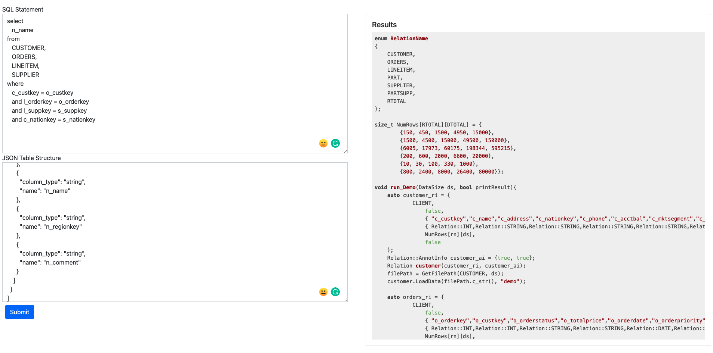

# SECYAN Codegen

[](https://github.com/sirily11/SECYAN-GEN/actions/workflows/test.yml)

A code generation project for SECYAN Repo. To run the code, see example/main.py for example.

A running example is hosted on this

- [Web App](https://sirily11.github.io/SECYAN-GEN/)

- [API](https://cwvf54ckb6.execute-api.ap-east-1.amazonaws.com/dev)

## Note

Some function may not be avaliable on the online version. You may want to deploy on your own. You can simply deploy this by using docker. First install docker, then run

```
docker-compose up
```


